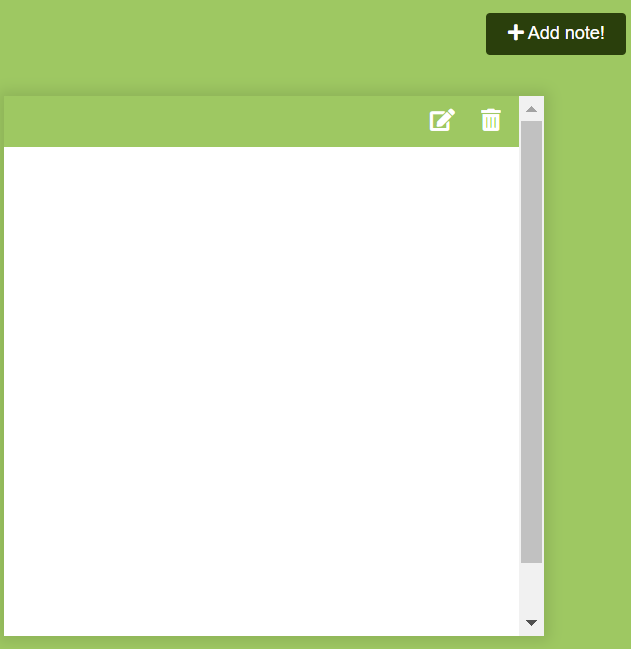

# Front-End Mini Projects Collection

This repository contains links to my mini front-end projects created using HTML, CSS, and JavaScript. Each project is unique, showcasing different concepts, techniques, and functionalities. For better visualization, an image of the output is included for each project.

---

## Projects

### 1. Countdown

[View Repository](https://github.com/Jayasri2021/Count-Down)

---

### 2. Adding Notes

[View Repository](https://github.com/Jayasri2021/Adding-Notes)

---

### 3. Good-Okay-Bad

[View Repository](https://github.com/yourusername/good-okay-bad)

---

### 4. Double Click Heart

[View Repository](https://github.com/yourusername/double-click-heart)

---

### 5. Generating Password

[View Repository](https://github.com/yourusername/generating-password)

---

### 6. Speed Running Text

[View Repository](https://github.com/yourusername/speed-running-text)

---

### 7. Git Profile Search

[View Repository](https://github.com/yourusername/git-profile-search)

---

### 8. Toast Notification

[View Repository](https://github.com/yourusername/toast-notification)

---
### 9. Double Vertical Slider

[View Repository](https://github.com/yourusername/double-vertical-slider)

---

### 10. Drawing App

[View Repository](https://github.com/yourusername/drawing-app)

---

### 11. Drag and Drop

[View Repository](https://github.com/yourusername/drag-and-drop)

---

### 12. Themed Analog Clock

[View Repository](https://github.com/yourusername/themed-analog-clock)

---

### 13. Background Slider

[View Repository](https://github.com/yourusername/background-slider)

---

### 14. Water Intake Measure

[View Repository](https://github.com/yourusername/water-intake-measure)

---

## How to Use

1. Clone this repository.
2. Navigate to any project by clicking the links above.
3. View the code and output.
